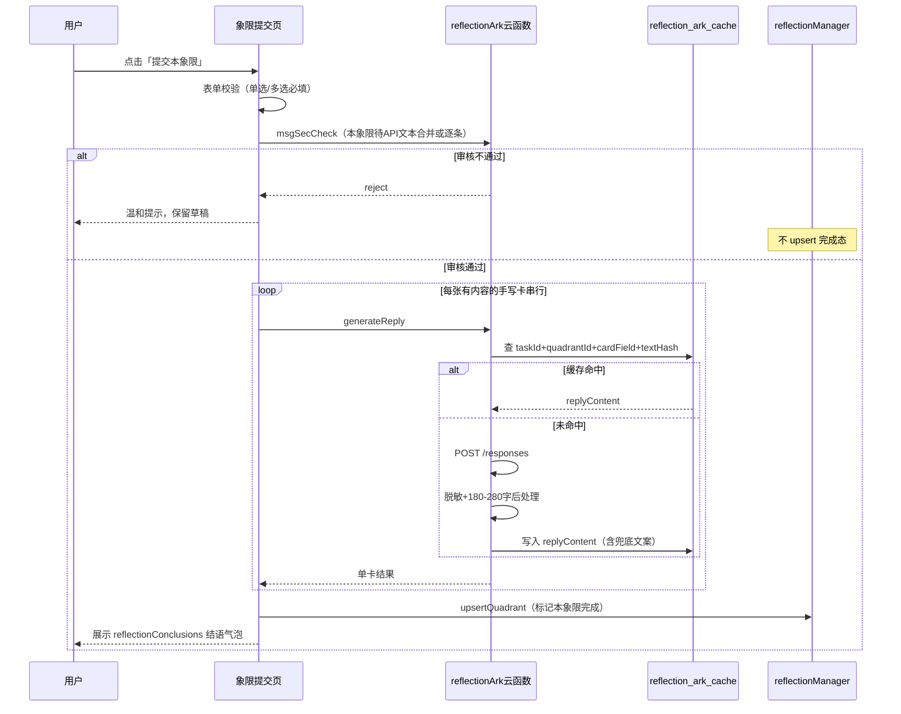

# 哲思复盘 · 火山方舟 Responses API 联调说明

> **文档版本**：v1.0（指令 0 交付物）  
> **依据**：哲思复盘 PRD v1.0 最终定稿  
> **状态**：接口字段以本文「冻结区」为准；**步骤 1 开发前**须用 curl 真机通调勾选「联调确认清单」  
> **范围**：仅联调与对接约定，不含业务代码实现

---

## 1. 文档目的

1. 冻结火山方舟 **Responses API** 真实入参/出参字段名（禁止默认 Chat Completions 字段）。
2. 提供可复制的 **curl 样例** 与响应解析路径。
3. 对齐仓库 `reflectionQuadrantCards` / `reflectionTheme`，给出全象限 **cardField → 是否调 API → agent** 对照表。
4. 明确 **Q4 三分支**、**阻塞式提交**、**缓存** 与小程序调用约定。

---

## 2. 环境与端点

### 2.1 云函数环境变量（强制）

| 变量名 | 示例值 | 说明 |
|--------|--------|------|
| `ARK_API_KEY` | （控制台获取） | 仅云函数读取；**禁止**硬编码、**禁止**日志打印 |
| `ARK_BASE_URL` | `https://ark.cn-beijing.volces.com/api/v3` | 不含路径后缀 |
| `ARK_MODEL_ID` | `ep-m-20260521214207-hxl7h` | 豆包 Endpoint ID（`ep-m-` 或 `ep-` 开头，勿填裸模型名） |

### 2.2 HTTP 端点

| 项 | 值 |
|----|-----|
| 方法 | `POST` |
| 完整 URL | `${ARK_BASE_URL}/responses` |
| 展开示例 | `https://ark.cn-beijing.volces.com/api/v3/responses` |
| 鉴权 Header | `Authorization: Bearer ${ARK_API_KEY}` |
| 内容类型 | `Content-Type: application/json` |

### 2.3 调用参数（业务侧约定）

| 项 | 值 |
|----|-----|
| 单请求超时 | 15s（云函数内 `fetch`/HTTP 客户端） |
| 失败重试 | 1 次（仅对网络/5xx 类可重试错误） |
| `max_output_tokens` | `500`（联调时确认字段名是否为 `max_output_tokens`，见 §4.3） |
| 输出字数后处理 | 按用户手写字数分档 **min–max**；短档不硬垫套话；报告页单独展示「小麒说/小麟说」 |

---

## 3. PRD 逻辑模板 vs Responses 真实字段（禁止混用）

PRD 中的逻辑模板（便于产品理解）：

```json
{
  "model": "${ARK_MODEL_ID}",
  "system": "完整人设 System 提示词",
  "messages": [{ "role": "user", "content": "用户手写原文" }]
}
```

**Responses API 不使用** Chat Completions 的顶层 `messages` / `system` 字段。  
官方最小骨架与推荐映射见 §4。

---

## 4. Responses API 冻结区（联调后勾选）

> 来源：火山方舟官方「创建模型响应」及社区实战文档；**以你方 curl 返回为准** 勾选「已确认」。

### 4.1 请求体（推荐冻结结构）

联调通过后，`reflectionArk` 向方舟发起的请求建议冻结为：

```json
{
  "model": "<ARK_MODEL_ID>",
  "instructions": "<personas.js 中对应 agent 的完整 system 全文>",
  "input": [
    {
      "role": "user",
      "content": "<经脱敏后的用户手写原文；可附带象限/题目上下文>"
    }
  ],
  "max_output_tokens": 500,
  "stream": false
}
```

| 字段 | 冻结约定 | 联调确认 |
|------|----------|----------|
| `model` | 必填，值 = `ARK_MODEL_ID` | ☐ |
| `instructions` | 必填，完整人设 system（不精简） | ☐ |
| `input` | 必填；字符串或消息数组；本项目用 **消息数组** | ☐ |
| `input[].role` | `user`（system 已走 `instructions`） | ☐ |
| `input[].content` | 用户手写正文 | ☐ |
| `max_output_tokens` | `500`；若官方仅支持 `max_tokens` 则改字段名并记录 | ☐ |
| `stream` | `false`（v1 非流式） | ☐ |

**备选方案（若 curl 证明 `instructions` 不可用）**：将 system 放入 `input` 首条 `{ "role": "system", "content": "..." }`，并在联调记录中注明，全项目统一一种写法。

**v1 不使用**：`previous_response_id`、`tools`、`previous_response_id` 多轮缓存（二期再评估）。

### 4.2 响应体解析（冻结路径）

非流式成功响应建议按以下路径取正文（与官方 `output` 数组结构一致）：

```text
response.output[] 
  → 取最后一项 item 
  → 当 item.type === "message" 
  → item.content[0].text   // 主正文
```

| 路径 | 用途 | 联调确认 |
|------|------|----------|
| `output[].type === "message"` | 文本结果 | ☐ |
| `content[0].text` | 写入 `replyContent` 的原始 AI 文本 | ☐ |
| `usage` | 可选记日志（不含用户原文） | ☐ |
| `error` / HTTP 4xx/5xx | 走重试 → `reflectionArkFallback` | ☐ |

### 4.3 联调确认清单（步骤 1 开工门禁）

- [ ] `POST ${ARK_BASE_URL}/responses` 返回 200 且能解析出正文  
- [ ] `instructions` + `input[]` 方案可用（或已记录备选 system-in-input 方案）  
- [ ] `max_output_tokens`（或等价字段）生效，输出长度与 500 token 上限匹配  
- [ ] 错误响应结构已记录（便于静默日志 `errCode`）  
- [ ] **禁止**在仓库出现 `chat/completions` 路径或 Chat 专用字段  

---

## 5. curl 样例

### 5.1 最小连通性（官方骨架）

```bash
curl --location "https://ark.cn-beijing.volces.com/api/v3/responses" \
  --header "Authorization: Bearer $ARK_API_KEY" \
  --header "Content-Type: application/json" \
  --data '{
    "model": "ep-m-20260521214207-hxl7h",
    "input": "你好，请用一句话回复。"
  }'
```

### 5.2 本项目推荐形态（哲思复盘单卡）

将 `$ARK_API_KEY`、`instructions` 替换为真实值后执行：

```bash
curl --location "https://ark.cn-beijing.volces.com/api/v3/responses" \
  --header "Authorization: Bearer $ARK_API_KEY" \
  --header "Content-Type: application/json" \
  --data '{
    "model": "ep-m-20260521214207-hxl7h",
    "instructions": "你为小麟……（此处粘贴 personas.js 完整 system，联调时可先用短句占位）",
    "input": [
      {
        "role": "user",
        "content": "今天有什么让你觉得卡住了？（用户手写原文示例）"
      }
    ],
    "max_output_tokens": 500,
    "stream": false
  }'
```

### 5.3 解析示例（Node 伪代码）

```javascript
function extractReplyText(arkResponse) {
  const output = arkResponse && arkResponse.output;
  if (!Array.isArray(output) || output.length === 0) return "";
  const last = output[output.length - 1];
  if (!last || last.type !== "message" || !Array.isArray(last.content)) return "";
  const part = last.content[0];
  return part && typeof part.text === "string" ? part.text.trim() : "";
}
```

---

## 6. 小程序 ↔ 云函数内部约定（非方舟直连）

前端 **不** 直连方舟；统一调用云函数 `reflectionArk`（步骤 1 实现）。

### 6.1 云函数 action 建议

| action | 说明 |
|--------|------|
| `msgSecCheck` | 封装 `cloud.openapi.security.msgSecCheck`；见 §8 |
| `generateReply` | 单张手写卡：读缓存 →  miss 则调方舟 → 后处理 → 写缓存 |
| `generateQuadrantBatch` | 可选：单象限多卡串行（与阻塞提交配合） |

### 6.2 `generateReply` 入参（内部）

```js
{
  action: "generateReply",
  taskId: string,
  quadrantId: 1 | 2 | 3 | 4,
  cardField: string,      // 见 §7 cardField 枚举
  userText: string,       // 规范化前原文（云函数内再 normalize + hash）
  agentType: "xiaolin" | "xiaoqi"
}
```

### 6.3 `generateReply` 出参（内部）

```js
{
  ok: true,
  replyContent: string,   // 按用户输入分档字数后处理
  fromCache: boolean,
  textHash: string
}
// 失败且已兜底：ok: true, fromCache: false, replyContent: <fallback>, fallback: true
// 内容安全失败：ok: false, code: "MSG_SEC_REJECT"
```

---

## 7. 全象限 cardField 对照表

> 对齐：`miniprogram/config/reflectionQuadrantCards.js`、`reflectionTheme.js`  
> **agent**：Q1/Q2 → `xiaolin`（小麟）；Q3/Q4 → `xiaoqi`（小麒）

### 7.1 总表

| 象限 | 名称 | cardField | 卡片类型 | 调 API | agent | 备注 |
|------|------|-----------|----------|--------|-------|------|
| Q1 | 观实归真 | `c0` | text | **是** | xiaolin | 有内容才调 |
| Q1 | 观实归真 | `c1` | single | 否 | — | 本地 `reflectionReportNarrative` + 提交页气泡 |
| Q1 | 观实归真 | `c2` | text | **是** | xiaolin | 有内容才调 |
| Q2 | 观心明己 | `c0` | text | **是** | xiaolin | 三卡均可独立缓存 |
| Q2 | 观心明己 | `c1` | text | **是** | xiaolin | |
| Q2 | 观心明己 | `c2` | text | **是** | xiaolin | 报告页长文与 `Q2_CONCLUSION_BUBBLES` 短句区分 |
| Q3 | 自我主宰 | `c0` | text | **是** | xiaoqi | |
| Q3 | 自我主宰 | `c1` | single | 否 | — | 本地规则 + 提交页气泡 |
| Q3 | 自我主宰 | `c2` | text | **是** | xiaoqi | |
| Q4 | 踏实前行 | `c0` | text | **是** | xiaoqi | 主文本，与多选无关 |
| Q4 | 踏实前行 | `c1` | text | **是** | xiaoqi | 主文本 |
| Q4 | 踏实前行 | `c2` | multi 选项 | 否 | — | 选项文案本地 |
| Q4 | 踏实前行 | `c2_experience` | multi 展开 | 条件 | xiaoqi | 见 §7.3 |
| Q4 | 踏实前行 | `c2_feeling` | multi 展开 | 条件 | xiaoqi | 见 §7.3 |
| Q4 | 踏实前行 | `c2_decision` | multi 展开 | 条件 | xiaoqi | 见 §7.3 |

### 7.2 禁止调用 API（全象限通用）

- 所有 `single` / `multi` **选项标签**（非用户手写）
- `reflectionConclusions` 提交页短气泡（含 `Q4_NOTHING_BUBBLE` 等）
- `reflectionReportNarrative` 中 `output_by_choice`、`echo_by_selection` 等选择题衍生段
- 空白手写：不调 API、不写缓存，报告展示「暂未填写」

### 7.3 Q4 三分支（冻结）

| 场景 | 条件 | 多选板块 API | 报告多选段 |
|------|------|--------------|------------|
| **A. 仅 nothing** | `selected === ['nothing']` 且 experience/feeling/decision 均为空 | **不调** | 本地 `Q4_NOTHING_BUBBLE` + narrative `only_nothing` |
| **B. 主文本** | `c0` 或 `c1` 有手写内容 | **调 API**（对应 cardField） | 「你说」+ 缓存解读 |
| **C. 混合多选** | 勾选 nothing **且** 勾选其他项，或仅勾选 experience/feeling/decision | 展开区**有内容**的子项 **调 API** | 多选 lead 本地 + 各展开段 API |

展开区与存储字段对应（`buildCardResponses`）：

| cardField | 勾选前提 | 存储字段 |
|-----------|----------|----------|
| `c2_experience` | `selected` 含 `experience` | `resp.experience` |
| `c2_feeling` | `selected` 含 `feeling` | `resp.feeling` |
| `c2_decision` | `selected` 含 `decision` | `resp.decision` |

---

## 8. 阻塞式提交流程（方案 A）



| 步骤 | 规则 |
|------|------|
| 1 | 校验失败 → 不进入安全/API 流程 |
| 2 | `msgSecCheck` 不通过 → **不**写缓存、**不** `upsertQuadrant` 完成态；表单草稿保留 |
| 3 | 无内容的手写卡 → **跳过** API 与缓存写入 |
| 4 | 有内容卡 → **串行** `generateReply`；失败重试 1 次后写 **fallback** 到 `replyContent` |
| 5 | **全部** 目标卡处理完后 → `upsertQuadrant` → 再显示结语气泡（阻塞式） |
| 6 | 进入报告页 → **只读** `reflection_ark_cache`，不再请求方舟 |

---

## 9. 缓存 `reflection_ark_cache`

### 9.1 集合文档结构

```js
{
  taskId: String,
  quadrantId: Number,       // 1-4
  cardField: String,        // c0 | c1 | c2 | c2_experience | c2_feeling | c2_decision
  textHash: String,         // SHA256(normalize(userText))
  agentType: String,        // xiaoqi | xiaolin
  replyContent: String,     // AI 或 fallback，报告页直接读
  createdAt: Date
}
```

### 9.2 唯一性

复合唯一：**`taskId + quadrantId + cardField + textHash`**

### 9.3 文本归一化（哈希前）

1. `trim()` 首尾空白  
2. 换行统一为 `\n`（`\r\n` → `\n`）  
3. 连续空白压缩为单个空格（可选：仅压缩空格/tab，保留换行）  
4. 对归一化结果做 **SHA256**， hex 编码存入 `textHash`

### 9.4 权限

| 端 | 权限 |
|----|------|
| 云函数 | 读写 |
| 小程序 | **只读**（报告页/提交结果展示） |

### 9.5 环境策略

全环境统一：**缓存优先**；未命中再调方舟；正式版不做环境拦截。

---

## 10. 内容安全与脱敏

| 顺序 | 环节 |
|------|------|
| 1 | 用户提交 → 云函数封装 `msgSecCheck`（前端不裸调 openapi） |
| 2 | 通过 → `generateReply` → 方舟（平台默认内容策略，v1 不另做二次审核接口） |
| 3 | 云函数发送前脱敏：手机号、身份证、住址、真实姓名等 |

---

## 11. 报告页拼装索引（步骤 5 参考）

| 段落类型 | 数据来源 |
|----------|----------|
| 单选/多选复盘 | `reflectionReportNarrative.js` 本地规则 |
| 手写有内容 | 行1：`formatUserSays`；行2：`reflection_ark_cache.replyContent` |
| 手写无内容 | `EMPTY_LABEL` = 「暂未填写」 |
| API/方舟失败 | `reflectionArkFallback.js`（**禁止**降级为 `echoQ*` 长文） |
| 排版 | 报告专属 wxss；**禁止 emoji** |

---

## 12. 小程序封装（指令 3）

| 模块 | 路径 |
|------|------|
| 云函数客户端 | `miniprogram/utils/reflectionArkClient.js` |
| 缓存只读 | `miniprogram/utils/reflectionArkCache.js` |
| 手写 API 映射 | `miniprogram/config/reflectionArkApiMap.js` |
| 配置常量 | `miniprogram/config/reflectionArkConfig.js` |
| textHash（与云函数一致） | `miniprogram/utils/reflectionArkTextHash.js` |

---

## 13. 相关源码路径

| 模块 | 路径 |
|------|------|
| 象限卡片 | `miniprogram/config/reflectionQuadrantCards.js` |
| 象限元数据/角色 | `miniprogram/config/reflectionTheme.js` |
| 提交结语气泡 | `miniprogram/config/reflectionConclusions.js` |
| 报告本地叙事 | `miniprogram/utils/reflectionReportNarrative.js` |
| 报告视图 | `miniprogram/utils/reflectionReport.js` |
| 象限提交页 | `miniprogram/subpkg/reflection-quadrant/index.js` |
| 报告页 | `miniprogram/subpkg/reflection-report/` |
| 云函数（待建） | `cloudfunctions/reflectionArk/` |
| 人设常量（待建） | `cloudfunctions/reflectionArk/personas.js` |
| 兜底文案（待建） | `cloudfunctions/reflectionArk/reflectionArkFallback.js` |

---

## 14. 指令 0 验收勾选

- [x] 含 `POST ${ARK_BASE_URL}/responses` 完整 URL 说明  
- [x] 含 `cardField` 全集（含 `c2_experience` / `c2_feeling` / `c2_decision`）  
- [x] 含 Q4 三分支 A/B/C  
- [x] 含阻塞式提交流程（含 mermaid 时序）  
- [x] 含 curl 样例（最小 + 业务推荐）  
- [x] 含 Responses 与 Chat Completions 字段区分  
- [ ] **步骤 1 前**：curl 真机通调后勾选 §4.3 联调确认清单  

---

## 15. 官方文档链接

- [创建模型响应（Responses API）](https://www.volcengine.com/docs/82379/1569618?lang=zh)
- [迁移至 Responses API](https://www.volcengine.com/docs/82379/1585128?lang=zh)
- [The response object](https://www.volcengine.com/docs/82379/1569619?lang=zh)（文档中心 API 参考目录）
- [火山方舟 Responses API 实战指南（社区）](https://developer.volcengine.com/articles/7565184101091639338)

---

*本文档仅服务指令 0；业务实现见指令 1–6。*
